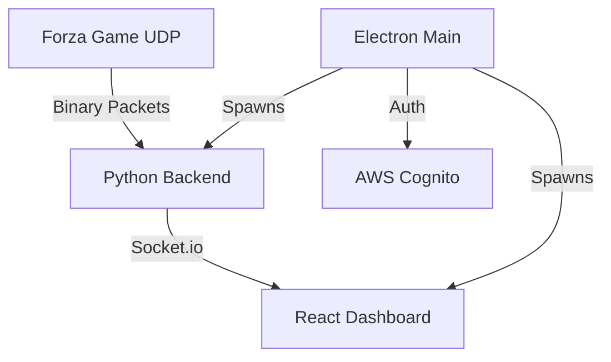

# Forza Virtual Race Engineer

Real-time telemetry analysis tool for Forza Motorsport and Forza Horizon. Capture, parse, and visualize your racing data with a professional-grade dashboard.

## 📋 Project Overview

Forza Virtual Race Engineer is a desktop application designed to provide sim racers with deep insights into their driving performance. By capturing high-frequency UDP telemetry data directly from Forza games, the application provides real-time visualizations of engine RPM, speed, G-forces, pedal inputs, and lap timing.

Key features include:

- **Real-time Dashboard:** Gauges and charts for immediate feedback.
- **Lap Telemetry:** Track and compare lap times and performance metrics.
- **Secure Authentication:** User login powered by AWS Cognito.
- **Cross-Platform:** Built to run on Windows, macOS, and Linux.

## 🏗️ System Architecture

The application follows a modular, three-tier architecture orchestrated by Electron:

1.  **Electron (Main Process):** Acts as the central orchestrator. It manages the application lifecycle, handles secure communication with AWS Cognito for authentication, and spawns/manages the backend and frontend processes.
2.  **Python Backend (Telemetry Server):** A high-performance Flask-SocketIO server. It includes a dedicated UDP listener that captures binary data packets from the game, parses them using a custom `TelemetryParser`, and broadcasts the results via WebSockets.
3.  **React Frontend (Dashboard):** A modern, responsive UI built with React 19 and TypeScript. It connects to the backend via Socket.io to receive real-time updates and uses Recharts for data visualization.



## 🤖 AI-Assisted Workflow

This project is developed and maintained using an **AI-First Workflow**. We leverage advanced AI models (Gemini and Claude) for:

- **Code Generation & Refactoring:** Rapid prototyping and architectural improvements.
- **Documentation:** Automated generation of technical docs and READMEs.
- **Debugging:** Systematic root-cause analysis and automated fix suggestions.
- **Maintenance:** Using tools like `gemini-cli` and `gemini-kit` to ensure codebase health and consistency.

The project includes specialized AI context files (like `GEMINI.md`) to help AI agents understand the system architecture and development patterns instantly.

## 🛠️ Tech Stack

- **Framework:** [Electron](https://www.electronjs.org/)
- **Frontend:** [React 19](https://react.dev/), [TypeScript](https://www.typescriptlang.org/), [Vite](https://vitejs.dev/), [Recharts](https://recharts.org/)
- **Backend:** [Python 3](https://www.python.org/), [Flask](https://flask.palletsprojects.com/), [Flask-SocketIO](https://flask-socketio.readthedocs.io/), [Eventlet](https://eventlet.net/)
- **Data Parsing:** Custom Binary Parser (`struct` based)
- **Auth:** [AWS SDK for JavaScript](https://aws.amazon.com/sdk-for-javascript/) (Cognito)
- **Dev Tools:** ESLint, PyInstaller

## 🚀 How to Run

### Prerequisites

- [Node.js](https://nodejs.org/) (v18 or higher)
- [Python 3.10+](https://www.python.org/)
- [Git](https://git-scm.com/)

### Development Setup

1.  **Clone the repository:**

    ```bash
    git clone https://github.com/youruser/ForzaVirtualRaceEngineer.git
    cd ForzaVirtualRaceEngineer
    ```

2.  **Install Dependencies:**

    ```bash
    # Install Electron & Frontend dependencies
    cd electron && npm install
    cd ../frontend && npm install

    # Setup Python Backend
    cd ../backend
    python -m venv venv
    source venv/bin/activate  # On Windows: venv\Scripts\activate
    pip install -r requirements.txt
    ```

3.  **Run in Development Mode:**
    ```bash
    cd electron
    npm run dev
    ```

### Building for Production

To create a standalone executable for your operating system, use the provided build scripts:

**macOS / Linux:**

```bash
./build.sh
```

**Windows:**

```bash
./build.bat
```

The application will be located in the `electron/dist` directory.

## 📝 Basic Details

- **License:** MIT
- **Author:** Ozkar300 and eangeles29
- **Version:** 1.0.0
- **Status:** Active Development

---

_Built with ❤️ for the Sim Racing Community._
